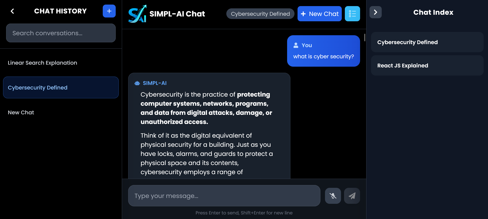
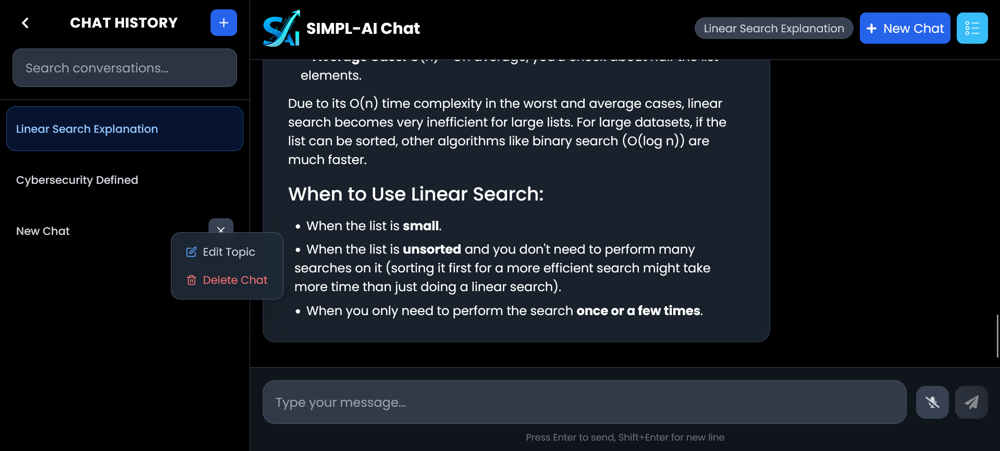
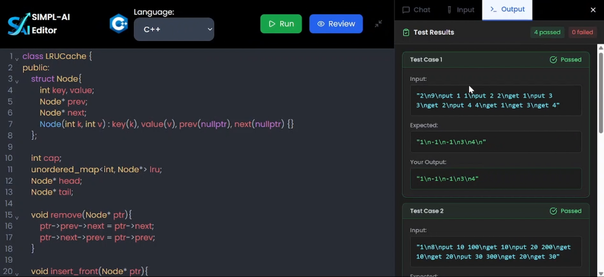
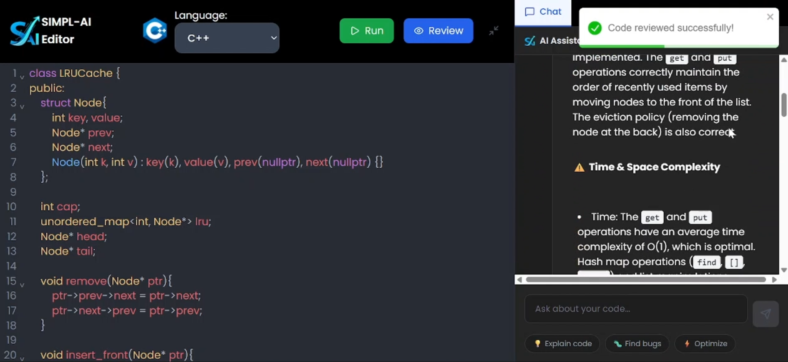

# **Simpl-AI: A Modern Platform of Intelligent Tools**

<div style="text-align: center;">
  
</div>


**Simpl-AI** is an innovative platform designed to bring the power of artificial intelligence closer to everyone — in the simplest, most intuitive form possible. Built around the belief that advanced technology should feel effortless, Simpl-AI delivers a suite of intelligent tools that enhance creativity, productivity, learning, and problem-solving across multiple domains.

Whether you are a student exploring new concepts, a developer building efficient logic, or a professional automating repetitive tasks, Simpl-AI offers a clean, flexible, and human-centered AI experience.

Currently, Simpl-AI includes two core tools, with many more under development.

---

## **🚀 Platform Tools**

### **1. AI Chat Assistant (with History & Voice Input)**

The Chat Assistant is a real-time conversational interface powered by the Google Gemini API.

**Key Capabilities:**

* **AI Conversations** for learning, brainstorming, and problem-solving.
* **Conversation History Management**

  * Create multiple chat instances
  * Rename chats
  * Delete chats
  * Search across previous conversations
* **Chat Indexing**
  Navigate long conversations instantly using an auto-generated chat index.
* **Speech-to-Text Input**
  Fast voice-based interaction using `react-speech-recognition` (Chrome only).
* **Clean and Responsive UI** optimized for both desktop and mobile.

---

### **2. Intelligent Code Editor (DSA & IO-Based Coding)**

A specialized code editor built for algorithmic and input-output style problems.

**How It Works:**

* You write only the **core logic** of the program.
* AI automatically injects:

  * Boilerplate code
  * Input/output handling
  * Five autogenerated test cases
* Code is executed on **Judge0** with support for:

  * **C++**
  * **Java**
  * **JavaScript**
  * **Python**
* Includes an **in-tool AI Assistant** for code-related queries.
* Enables fast prototyping, learning, and debugging.

---

## Some Screenshots
<div style="display: flex; justify-content: center; align-items: center; flex-direction: column; gap: 1rem">
  
  
  
  
  
  
  
</div>


## **🛠️ Tech Stack**

### **Frontend**

* React.js (Hooks + Context API)
* Tailwind CSS
* CodeMirror (code editor)
* Axios
* React Toastify
* react-speech-recognition

### **Backend**

* Node.js (Express.js)
* MySQL
* Google Gemini API (Generative AI)
* Judge0 API (Code execution)
* Better-Auth (Authentication layer)

### **Other**

* UUID for unique identifiers
* Regenerator Runtime for async handling

---

## **📁 Project Structure**

```
simpl-ai/
   ├── frontend/
   ├── backend/
   └── README.md
```

---

## **🔐 Environment Variables**

### **Backend `.env`**

```
DATABASE_PASS
DB_HOST
DB_USER
DB_NAME

# Gemini API
VITE_API_KEY

# Judge0 API
RAPIDAPI_KEY

# Authentication
BETTER_AUTH_SECRET
BETTER_AUTH_URL

NODE_ENV="development" or "production"
```

### **Frontend `.env`**

```
VITE_API_KEY (gemini)
RAPIDAPI_KEY
```

---

## **📦 Installation & Setup**

### **Prerequisites**

* Node.js 14+
* MySQL Server
* A valid Gemini API key
* A RapidAPI (Judge0) key

---

### **Backend Setup**

```bash
git clone https://github.com/Roshan-Singh001/Simpl-AI
cd Simpl-AI/backend
npm install
```

1. Create a MySQL database.
2. Configure `.env` with your credentials.
3. Start the server:

```bash
npm start
```

---

### **Frontend Setup**

```bash
cd ../frontend
npm install
```

Add the required variables to the `.env` file.

Start the development server:

```bash
npm start
```

Visit:

```
http://localhost:5173
```

---

## **🧑‍💻 Usage Overview**

### **Chat Assistant**

* Start or switch between chat instances.
* Search or rename chats.
* Use voice input for faster interaction.
* Navigate long chats using the indexed menu.

### **Code Editor**

* Write only the core logic.
* Let AI produce boilerplate and generate test cases.
* Run code on Judge0.
* Chat with the integrated AI assistant for help.

---

## **🤝 Contributing**

Contributions are welcome.

1. Fork the repository
2. Create a feature branch
3. Commit your changes
4. Submit a pull request

---

## **📄 License**

This project is released under the **MIT License**.

---

